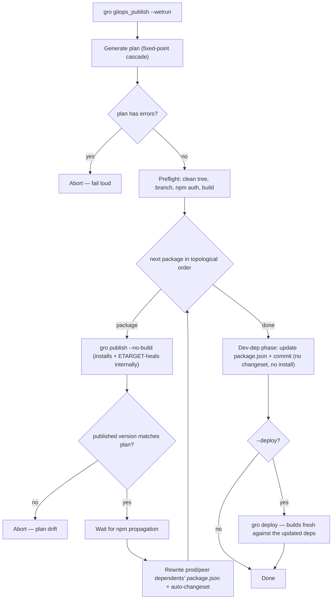

# Publishing Guide

This guide covers multi-repo publishing workflows, changeset semantics, and the
algorithms that power fuz_gitops publishing.

## Table of Contents

- [Quick Start](#quick-start)
- [Changeset Semantics](#changeset-semantics)
- [Plan vs Dry Run](#plan-vs-dry-run)
- [Publishing Flow](#publishing-flow)
- [Publishing Algorithms](#publishing-algorithms)
- [Private Packages](#private-packages)
- [Workflows](#workflows)
- [Examples](#examples)

## Quick Start

```bash
# 1. Validate configuration (no side effects)
gro gitops_validate

# 2. Review what will be published
gro gitops_plan

# 3. Publish (after dry run looks good)
gro gitops_publish --wetrun
```

## Changeset Semantics

Packages can publish in four distinct scenarios:

### 1. Explicit Changesets (Normal Publishing)

- Package has `.changeset/*.md` files
- Dependency updates don't require higher bump
- Behavior: Published with version bump from changesets
- Reported as: "Version Changes (from changesets)"

### 2. Explicit Changesets with Bump Escalation

- Package has `.changeset/*.md` files specifying bump type
- BUT dependency updates require a HIGHER bump
- Behavior: Published with escalated bump (e.g., `patch` → `minor` for breaking
  dep)
- Reported as: "Version Changes (bump escalation required)"
- Example: You write `patch` changeset, but `gro` (breaking) forces `minor`

### 3. Auto-Generated Changesets

- Package has NO `.changeset/*.md` files
- BUT has production/peer dependency updates
- Behavior: Changeset auto-generated, package republished
- Reported as: "Version Changes (auto-generated for dependency updates)"
- Example: `gro` publishes → `fuz` depends on `gro` → auto-changeset for `fuz`

### 4. No Changes to Publish

- Package has NO `.changeset/*.md` files
- Package has NO production/peer dependency updates
- Behavior: Skipped (not published)
- Reported as: Informational status (not a warning)
- This is normal: Only packages with changes should publish

### Dependency Update Behavior

When a dependency is updated:

- **Production/peer deps**: Package must republish (triggers auto-changeset if
  needed)
- **Dev deps**: Package.json updated, NO republish (dev-only changes)

When a package appears in both production/peer and dev dependencies,
production/peer takes priority for dependency graph calculations.

## Plan vs Dry Run

### `gro gitops_plan`

- **Read-only prediction** - Generates a publishing plan showing what would be
  published
- Uses fixed-point iteration to resolve transitive cascades (max 10 iterations)
- Shows all 4 publishing scenarios: explicit changesets, bump escalation,
  auto-generated changesets, and no changes
- No side effects - does not modify any files or state
- Reads each repo's working tree **as-is** (whatever branch is checked out, even
  with uncommitted changes). Pass `--sync` to switch to the configured branch and
  pull first, or run `gro gitops_sync` beforehand, so the plan reflects the
  canonical branches rather than your local checkout.

### `gro gitops_publish` (dry run, default)

- **Plan-driven preview** - The dry run reports the same plan as `gro
gitops_plan`, so it shows the full cascade: explicit changesets, bump
  escalations, and auto-generated changesets
- Skips preflight checks (workspace, branch, npm auth)
- No side effects - reports what `--wetrun` would publish without touching git or
  npm
- The dry-run count matches `gro gitops_plan`; the difference between them is
  framing, not content (`plan` is the read-only report, the dry run is the
  publish command in preview mode)
- Add `--preview` to print the ordered side-effects (publishes, npm waits,
  dependency rewrites, dev-dep updates, deploys) the cascade would perform

## Publishing Flow

A real publish (`gro gitops_publish --wetrun`) generates the plan once, then executes
it as a frozen, single-pass cascade. The plan is the single source of truth — the
executor re-derives nothing and fails loud rather than diverge from it.



Each `gro publish --no-build` step is itself a pipeline: it syncs, installs (this
install self-heals npm's stale-cache ETARGET — clear the cache and retry once when a
just-published version isn't visible yet), runs `gro check` (typecheck + tests against
the freshly-installed dependency versions), bumps the version, installs again to refresh
the lockfile, and regenerates — it only skips the final `gro build`. So a dependency that
breaks a dependent is caught by that `gro check` and aborts the run. The executor itself
never runs a bare `npm install`: gro owns installing (and healing), so a dependent's deps
are installed when its own `gro publish` reaches it.

Dev-dep-only dependents never run `gro publish`, so the executor bumps + commits their
`package.json` without installing them; gro refreshes (and heals) their `node_modules`
the next time they build, deploy, or sync.

Deploys (`--deploy`) build fresh rather than reuse the preflight build, because a
deployed site bundles its dependencies and must reflect the versions just published.

## Publishing Algorithms

### Fixed-Point Iteration (Cascade Resolution)

The publishing plan generation uses fixed-point iteration to resolve transitive
breaking change cascades:

1. **Initial pass**: Identify all packages with explicit changesets
2. **Iteration loop** (max 10 iterations):
   - Calculate dependency updates based on predicted versions
   - For each package:
     - Check if dependencies require a bump (prod/peer deps only)
     - **Bump escalation**: If existing changesets specify lower bump than
       required, escalate
     - **Auto-changesets**: If no changesets but deps updated, generate
       auto-changeset
     - Track breaking changes to propagate to dependents
   - Loop until no new version changes discovered (fixed point reached)
3. **Final pass**: Calculate all dependency updates and cascades

The 10-iteration limit prevents infinite loops while handling complex dependency
graphs. In practice, most repos converge in 2-3 iterations.

This iteration happens during **plan generation**. The real publish
(`gro gitops_publish --wetrun`) then executes the frozen plan in a single linear
pass over the dependency order, re-deriving nothing — publishing a package
immediately creates its dependents' changesets, so one topological pass suffices.
If a publish produces a version the plan did not predict, publishing aborts
(fail-loud on drift) rather than silently diverging; re-running re-plans from the
current state.

### Cycle Detection Strategy

The system uses topological sort with dev dependency exclusion:

- **Production/peer cycles**: Block publishing (error, must be resolved)
  - These create impossible ordering: Package A depends on Package B which
    depends on Package A
  - Solution: Move one dependency to devDependencies or restructure
- **Dev cycles**: Allowed and normal (warning only)
  - Dev dependencies don't affect runtime, so cycles are safe
  - Topological sort excludes dev deps (`exclude_dev=true`) to break these
    cycles
- **Publishing order**: Computed via topological sort on prod/peer deps only
  - Ensures dependencies publish before dependents
  - Deterministic and reproducible
  - Dev dependencies updated in separate phase after all publishing completes
- **Dependency priority**: When a package appears in multiple dependency types,
  production/peer takes priority over dev

This strategy enables practical multi-repo patterns (e.g., shared test
utilities) while preventing runtime dependency issues.

## Private Packages

Packages with `"private": true` in package.json never publish:

- Marked as `publishable: false` in the dependency graph
- Excluded from the plan's version changes — no publish, npm-wait, bump
  escalation, or auto-changeset — so the executor skips them (they keep their
  slot in the topological order)
- A private package depending on a published one is updated as a leaf: its
  dependency ranges are rewritten and committed without a changeset (it won't
  republish)
- A private package carrying its own changeset is flagged in the plan's warnings,
  since that changeset can't be published
- Dependents can still publish normally
- Use for internal tools, test utilities, dev-only packages

## Workflows

### Safe Validation Workflow

Before publishing, always validate your configuration:

```bash
# 1. Run comprehensive validation (no side effects)
gro gitops_validate

# 2. Review analyze output
gro gitops_analyze

# 3. Review plan to see what will be published
gro gitops_plan

# 4. Test with dry run (default)
gro gitops_publish

# 5. If everything looks good, actually publish
gro gitops_publish --wetrun
```

### Output Formats

Save analysis or plans to files for review:

```bash
gro gitops_analyze --format json --outfile analysis.json
gro gitops_plan --format markdown --outfile plan.md
```

## Examples

### Publishing a single package with changesets

```bash
# Create a changeset for your package
cd packages/my-package
npx changeset
# Follow prompts to describe changes

# Generate plan to see what will be published
gro gitops_plan
# Output shows: my-package: 1.0.0 → 1.1.0 (minor)

# Publish
gro gitops_publish --wetrun
```

### Publishing multiple packages with cascading dependencies

```bash
# You have changesets in @my/core
# Dependents: @my/ui depends on @my/core

# Plan shows cascade
gro gitops_plan
# Output:
#   @my/core: 1.0.0 → 2.0.0 (major, BREAKING)
#   @my/ui: 1.5.0 → 2.0.0 (auto-changeset, BREAKING cascade)

# Publish in dependency order
gro gitops_publish --wetrun
```

### Recovering from failures (natural resumption)

```bash
# Publishing failed midway through
gro gitops_publish --wetrun
# Error: Failed to publish @my/package-5

# Fix the issue, then re-run the same command
gro gitops_publish --wetrun
# Already-published packages have no changesets → skipped automatically
# Failed packages still have changesets → retried automatically
```

### Bump escalation

```bash
# You created a patch changeset for @my/app
# But @my/core (dependency) has a breaking change

# Plan shows escalation
gro gitops_plan
# Output:
#   @my/core: 1.0.0 → 2.0.0 (major, BREAKING)
#   @my/app: 2.0.0 → 3.0.0 (patch → major, escalated)

# Publish handles escalation automatically
gro gitops_publish --wetrun
```
